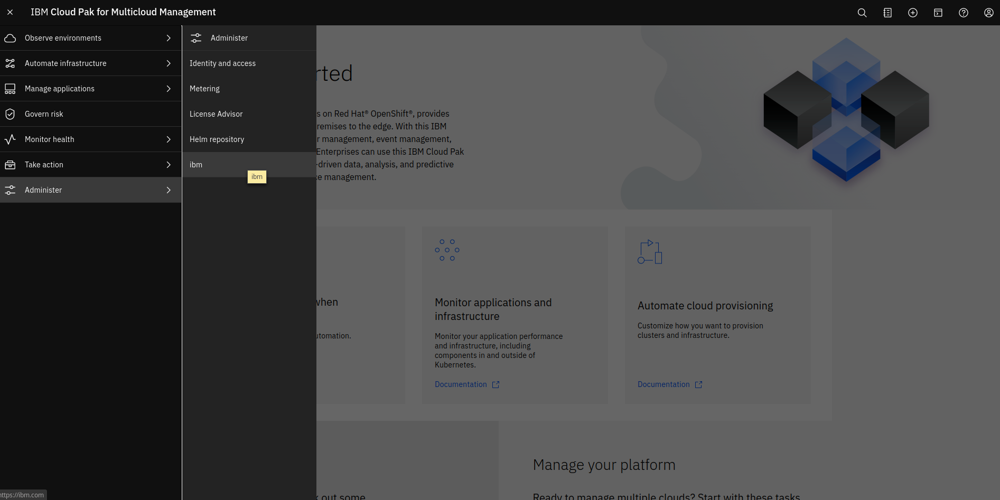

# Adding Applications to CloudPak Using the NavMenuEntry Custom-Resource
```
apiVersion: integrations.sdk.cp4mcm.ibm.com/v1beta1
kind: NavMenuEntry
metadata:
  name: ibm
  # This resource is Cluster-Scoped, so leave the namespace blank
spec:
  # The name of the browser tab that the link will be opened in
  target: "ibm"
  # The name that will be displayed on the item in the drop-down menu
  name: "ibm"
  # The submenu that the new entry will appear under, available options are:
  # "administer-mcm";"sre";"monitor";"costs";"automate";"applications";"observe"
  parentId: "administer-mcm"
  # User roles that will be able to see the menu item in the UI, available options are:
  # "ClusterAdministrator";"Administrator";"Operator";"Viewer";"Editor";"Auditor";"AccountAdministrator"
  roles:
    - name: ClusterAdministrator
    - name: Administrator
    - name: Operator
    - name: Viewer
  # The URL that the new menu entry will link to
  url: https://mysvc-myns.{{ .OpenShiftBaseUrl }} 
  # the {{ .OpenShiftBaseUrl }} template will automatically be replaced by the cluster's base-url if used,
  # '{' and '}' characters will need to be escaped if using Helm to ensure they are not interpreted as templates by Helm
  # escaping can be done like so: "{{ "{{" }} .OpenShiftBaseUrl {{ "}}" }}"
```


# [DEPRECATED] Adding Applications to CloudPak Navigation Menu with Helm Chart Annotations

When installing an application into CloudPak for MCM, it is possible to add it to the “hamburger” navigation menu so that users can launch it directly from within the CloudPak. This is done via a set of annotations to the application’s helm chart. With these in place, the installation will detect them and automatically add the new application to the menu. When the user selects the new application from the menu, the link launched will be the one extracted from the application’s own ingress object as also defined in the helm chart.

## Values used

Variables can be defined in the values.yaml file of a helm chart and used elsewhere. This is a best practice that allows a central place for them to be stored, modified, and overridden by users when installing. If we define the following values, we can use them in our templates:

`.Values.service.uiMenu.enabled`: A boolean value indicating whether the application should be added to the menu when installed or not. (Example value: true)

`.Values.service.uiMenu.name`: A string value providing the label that will appear on the menu. (Example value: My Application Name)

`.Values.service.uiMenu.id`: A string value which matches the internal identifier of one of the top-level menu items. The new application will be added as a sub-item on this menu. (Example value: administer-mcm to add to the Administer menu)

`.Values.service.uiMenu.roles`: A string value containing a comma-separate list of role names which are allowed visibility to the new application on the menu. (Example value: ClusterAdministrator,Administrator,Operator,Viewer)

`.Values.service.uiMenu.target`: A string value containing a name for a separate window/tab to launch into when the menu item is selected. (Example value: SDKExample)

`.Values.ingress.annotations.icp.management.ibm.com/auth-type`: An optional string value indicating how the user must be authenticated in order to have access to the new application on the menu. If not specified, no authentication is required. (Example value: access-token)

`.Values.ingress.annotations.kubernetes.io/ingress.class`: A mandatory string value that enables the internal mechanism which notifies the ui to check the ingress object for the application and add its external URL to the menu. (Example value: ibm-icp-management)

## Service template

In defining the application’s Kubernetes service helm chart we refer to the values defined in the previous section. The following are yaml values that need to be in the service yaml helm template:

`.metadata.labels.inmenu`: "{{ .Values.service.uiMenu.enabled }}" # Indicates to the UI to check this service definition for navigation menu annotations.

`.metadata.labels.target`: "{{ .Values.service.uiMenu.target }}" # Name of external window/tab to launch to when selected

`.metadata.annotations.name`: {{ .Values.service.uiMenu.name}} # The display name that will show in the menu

`.metadata.annotations.id`: {{ .Values.service.uiMenu.id }} # The id of the top-level menu item to attach to

`.metadata.annotations.roles`: {{ .Values.service.uiMenu.roles }}  # A list of roles you want to be able to view the app in the menu

## Ingress template

In defining the application’s Kubernetes ingress helm chart we refer to the values defined in the first section. All the values from .Values.ingress.annotations are simply copied in directly.

`.metadata.labels.inmenu`: "{{ .Values.service.uiMenu.enabled }}" # Indicates to the UI to check this service definition for navigation menu annotations.

To copy all the ingress annotations from the values.yaml:

```
  annotations: # NavMenu: add annotations from values.yaml
    {{- range $key, $value := .Values.ingress.annotations }}
      {{ $key }}: {{ $value | quote }}
    {{- end }}
```

The URL which will be the target of the application link on the navigation menu is taken from the path in the ingress definition, for example:

```
spec:
  rules:
    - http:
        paths:
          - path: /hello
```

in the ingress yaml template will result in the user being redirected to the path /hello on the cluster’s ingress when the application is selected from the navigation menu.

## Installing the example

To install the example helm chart provided, extract it onto your system and run the following command:
```
helm install -n sdkexample <your_directory>/CP4MCM-SDK/integration_scenarios/navmenu_integration/chart/sdk-navmenu-example/ --tls
```
